# Angular Concepts - Movie Booking Application

## Table of Contents
1. [Project Structure](#project-structure)
2. [Standalone Components vs Modules](#standalone-components-vs-modules)
3. [Components & Component Lifecycle](#components--component-lifecycle)
4. [Dependency Injection (DI)](#dependency-injection-di)
5. [Templates & Data Binding](#templates--data-binding)
6. [Directives](#directives)
7. [Pipes](#pipes)
8. [Input, Output & EventEmitter](#input-output--eventemitter)
9. [Signals & Computed Signals](#signals--computed-signals)
10. [Content Projection](#content-projection)
11. [Routing & Lazy Loading](#routing--lazy-loading)
12. [Guards](#guards)

---

## Project Structure

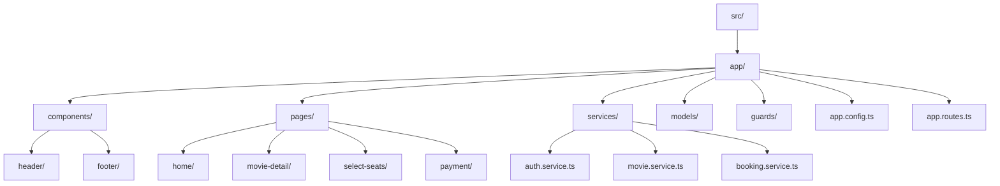

### File Organization

- **components/**: Reusable UI components (header, footer)
- **pages/**: Route-level components (home, movie-detail, etc.)
- **services/**: Business logic and data management
- **models/**: TypeScript interfaces for type safety
- **guards/**: Route protection logic
- **app.config.ts**: Application-wide configuration
- **app.routes.ts**: Routing configuration

---

## Standalone Components vs Modules

### Traditional NgModules (Old Approach)

In older Angular applications, you had to create NgModules:

```typescript
// app.module.ts (OLD WAY - NOT USED IN THIS PROJECT)
@NgModule({
  declarations: [AppComponent, HomeComponent],
  imports: [BrowserModule, HttpClientModule],
  providers: [MovieService],
  bootstrap: [AppComponent]
})
export class AppModule { }
```

### Standalone Components (Modern Approach - Used in This Project)

**Standalone components** eliminate the need for NgModules. Each component declares its own dependencies.

```typescript
// home.component.ts (FROM OUR PROJECT)
@Component({
  selector: 'app-home',
  standalone: true,  // ← This makes it standalone!
  imports: [CommonModule, HeaderComponent, FooterComponent],  // ← Direct imports
  templateUrl: './home.component.html',
  styleUrls: ['./home.component.css']
})
export class HomeComponent implements OnInit, OnDestroy {
  // Component logic
}
```

**Benefits of Standalone Components:**
- ✅ Less boilerplate code
- ✅ Easier to understand dependencies
- ✅ Better tree-shaking (smaller bundle sizes)
- ✅ Simpler testing
- ✅ Easier lazy loading

### Application Bootstrap (Standalone)

```typescript
// main.ts
import { bootstrapApplication } from '@angular/platform-browser';
import { AppComponent } from './app/app.component';
import { appConfig } from './app/app.config';

bootstrapApplication(AppComponent, appConfig);
```

```typescript
// app.config.ts (FROM OUR PROJECT)
export const appConfig: ApplicationConfig = {
  providers: [
    provideZoneChangeDetection({ eventCoalescing: true }),
    provideRouter(routes),
    provideHttpClient()  // ← Provides HttpClient globally
  ]
};
```

---

## Components & Component Lifecycle

### What is a Component?

A component is a building block of Angular applications. It controls a portion of the screen (a view).

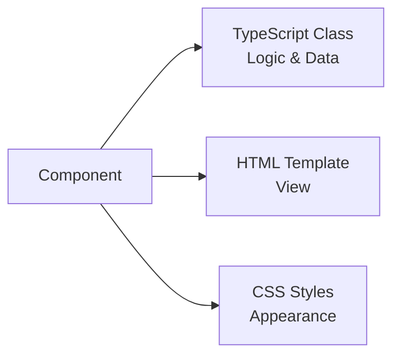

### Component Anatomy

```typescript
// select-seats.component.ts (FROM OUR PROJECT)
@Component({
  selector: 'app-select-seats',        // ← How to use: <app-select-seats></app-select-seats>
  standalone: true,                     // ← Standalone component
  imports: [CommonModule, HeaderComponent, FooterComponent],  // ← Dependencies
  templateUrl: './select-seats.component.html',  // ← External template
  styleUrls: ['./select-seats.component.css']    // ← External styles
})
export class SelectSeatsComponent implements OnInit {
  // Properties (data)
  selectedSeats: string[] = [];
  seatPrice = 50;
  
  // Constructor (dependency injection)
  constructor(
    private bookingService: BookingService,
    private router: Router
  ) {}
  
  // Lifecycle hook
  ngOnInit(): void {
    this.loadData();
  }
  
  // Methods (behavior)
  toggleSeat(seat: string): void {
    // Logic here
  }
}
```

### Component Lifecycle Hooks

Angular components have a lifecycle managed by Angular. You can tap into key moments using lifecycle hooks.

```mermaid
graph TD
    A[Constructor] --> B[ngOnChanges]
    B --> C[ngOnInit]
    C --> D[ngDoCheck]
    D --> E[ngAfterContentInit]
    E --> F[ngAfterContentChecked]
    F --> G[ngAfterViewInit]
    G --> H[ngAfterViewChecked]
    H --> I{Component<br/>Destroyed?}
    I -->|No| D
    I -->|Yes| J[ngOnDestroy]
```

#### Lifecycle Hooks Explained

| Hook | When It Runs | Use Case |
|------|-------------|----------|
| **constructor()** | When class is instantiated | Dependency injection only |
| **ngOnChanges()** | When @Input properties change | React to input changes |
| **ngOnInit()** | Once after first ngOnChanges | Initialize component, fetch data |
| **ngDoCheck()** | Every change detection cycle | Custom change detection |
| **ngAfterContentInit()** | After content projection | Access projected content |
| **ngAfterContentChecked()** | After every content check | React to content changes |
| **ngAfterViewInit()** | After view initialization | Access child components/DOM |
| **ngAfterViewChecked()** | After every view check | React to view changes |
| **ngOnDestroy()** | Before component destruction | Cleanup (unsubscribe, clear timers) |

#### Example from Our Project

```typescript
// home.component.ts
export class HomeComponent implements OnInit, OnDestroy {
  private autoScrollIntervals: any[] = [];

  constructor(
    private movieService: MovieService,
    private bookingService: BookingService,
    private router: Router
  ) {
    // ⚠️ DON'T fetch data here!
    // Constructor should only be used for dependency injection
  }

  ngOnInit(): void {
    // ✅ DO fetch data here
    this.loadMovies();
  }

  ngOnDestroy(): void {
    // ✅ Cleanup: Clear all intervals to prevent memory leaks
    this.autoScrollIntervals.forEach(interval => clearInterval(interval));
  }
}
```

**Why use ngOnInit instead of constructor?**
- Constructor runs before Angular sets up the component
- ngOnInit runs after Angular initializes all data-bound properties
- ngOnInit is the right place to fetch data or perform initialization logic

---

## Dependency Injection (DI)

### What is Dependency Injection?

DI is a design pattern where a class receives its dependencies from external sources rather than creating them itself.

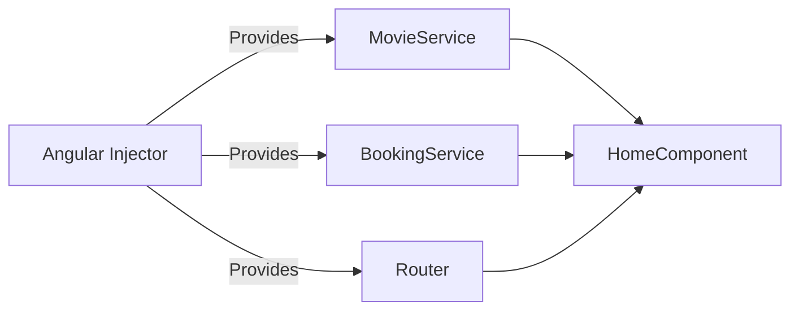

### How DI Works in Angular

#### 1. Service Definition with `@Injectable`

```typescript
// movie.service.ts (FROM OUR PROJECT)
@Injectable({
  providedIn: 'root'  // ← Singleton: One instance for entire app
})
export class MovieService {
  private baseUrl = '/assets/data';

  constructor(private http: HttpClient) {}  // ← HttpClient is injected

  getMovies(): Observable<Movie[]> {
    return this.http.get<Movie[]>(`${this.baseUrl}/movies.json`);
  }
}
```

**`providedIn: 'root'`** means:
- Angular creates a **single instance** (singleton) of this service
- Available throughout the entire application
- Automatically tree-shakeable (removed if not used)

#### 2. Injecting Services via Constructor

```typescript
// home.component.ts (FROM OUR PROJECT)
export class HomeComponent implements OnInit {
  constructor(
    private movieService: MovieService,      // ← Injected
    private bookingService: BookingService,  // ← Injected
    private router: Router                   // ← Injected
  ) {}
  
  ngOnInit(): void {
    // Now we can use the injected services
    this.movieService.getMovies().subscribe(movies => {
      this.movies = movies;
    });
  }
}
```

**How it works:**
1. Angular sees `MovieService` in the constructor
2. Checks if an instance exists in the injector
3. If not, creates one (because `providedIn: 'root'`)
4. Injects the instance into the component

#### 3. Modern Injection with `inject()` Function

```typescript
// auth.guard.ts (FROM OUR PROJECT)
export const authGuard: CanActivateFn = () => {
  const authService = inject(AuthService);  // ← Modern way
  const router = inject(Router);

  if (authService.isAuthenticated()) {
    return true;
  }

  router.navigate(['/signin']);
  return false;
};
```

**`inject()` function** is the modern way to inject dependencies:
- Can be used outside of constructors
- Useful in functional guards, interceptors, etc.
- Must be called in an injection context

### Singleton Pattern in Services

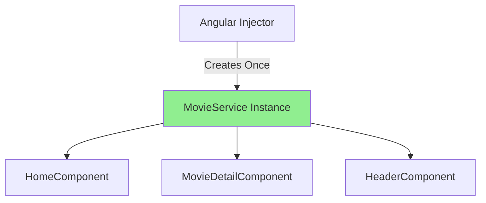

All components share the **same instance** of `MovieService`. This is important for:
- Sharing state across components
- Avoiding duplicate HTTP requests
- Memory efficiency

---

## Templates & Data Binding

Templates define the view of a component. Angular provides several ways to bind data between the component class and the template.

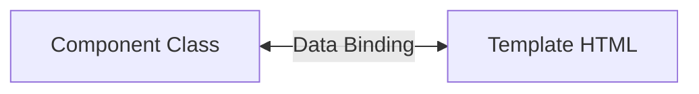

### Types of Data Binding

#### 1. Interpolation `{{ }}` - One-way (Component → Template)

Displays component data in the template.

```html
<!-- home.component.html (FROM OUR PROJECT) -->
<div class="section-title">
  {{ item.section.name }}  <!-- ← Displays section name -->
</div>

<div class="movie-title">{{ movie.title }}</div>
<span>{{ movie.rating || '8/10' }}</span>  <!-- ← With default value -->
```

```typescript
// Component
export class HomeComponent {
  searchTerm = 'Avengers';  // This value is displayed
}
```

**String Interpolation** converts the expression to a string and displays it.

#### 2. Property Binding `[]` - One-way (Component → Template)

Binds component property to an element property or directive.

```html
<!-- home.component.html (FROM OUR PROJECT) -->

<!--  ↑ Property binding                        ↑ Property binding -->

<div [class.chosen]="isSelected(seat)">  <!-- ← Conditional class -->
<div [title]="movie.title">  <!-- ← HTML attribute -->
```

**Syntax:**
- `[property]="expression"` - Binds to DOM property
- `[attr.aria-label]="value"` - Binds to HTML attribute
- `[class.active]="isActive"` - Adds/removes CSS class
- `[style.color]="color"` - Binds to inline style

#### 3. Event Binding `()` - One-way (Template → Component)

Listens to events and calls component methods.

```html
<!-- select-seats.component.html (FROM OUR PROJECT) -->
<button (click)="confirmSeats()">CONFIRM</button>
<!--     ↑ Event binding -->

<div (click)="toggleSeat(seat)">{{ seat }}</div>

<button (click)="goBack()">RETURN</button>
```

```typescript
// Component
export class SelectSeatsComponent {
  confirmSeats(): void {
    if (this.selectedSeats.length === 0) {
      alert('Please select at least one seat.');
      return;
    }
    this.router.navigate(['/payment']);
  }
}
```

**Common Events:**
- `(click)` - Mouse click
- `(input)` - Input value change
- `(submit)` - Form submission
- `(blur)` - Element loses focus
- `(mouseenter)`, `(mouseleave)` - Mouse hover

#### Passing Event Object

```html
<!-- home.component.html (FROM OUR PROJECT) -->
<button (click)="scrollLeft($event)">←</button>
<!--                        ↑ $event is the DOM event -->
```

```typescript
scrollLeft(event: Event): void {
  const button = event.target as HTMLElement;
  const section = button.closest('.section');
  // Use event to access DOM elements
}
```

#### 4. Two-Way Binding `[()]` - Bidirectional

Combines property and event binding for two-way data flow.

```html
<!-- header.component.html (FROM OUR PROJECT) -->
<input 
  type="search" 
  [(ngModel)]="searchTerm"
  (input)="onSearchInput()"
  placeholder="Search movies..."
/>
<!-- ↑ Two-way binding: updates searchTerm when user types -->
```

```typescript
// Component
export class HeaderComponent {
  searchTerm = '';  // ← This updates automatically when user types
  
  onSearchInput(): void {
    console.log(this.searchTerm);  // Always has the latest value
  }
}
```

**How `[(ngModel)]` works:**
```html
<!-- This: -->
<input [(ngModel)]="searchTerm" />

<!-- Is shorthand for: -->
<input 
  [ngModel]="searchTerm" 
  (ngModelChange)="searchTerm = $event"
/>
```

**Requirements for ngModel:**
- Must import `FormsModule` in the component

```typescript
@Component({
  imports: [CommonModule, FormsModule],  // ← Required for ngModel
})
```

#### 5. Template Reference Variables `#`

Create a reference to an element in the template.

```html
<!-- movie-detail.component.html (FROM OUR PROJECT) -->
<select #locationSelect [(ngModel)]="currentLocationFilter">
  <option value="All">All</option>
</select>

<!-- Can reference it in the same template -->
<button (click)="console.log(locationSelect.value)">Log Value</button>
```

### Data Binding Summary

| Syntax | Direction | Example | Use Case |
|--------|-----------|---------|----------|
| `{{ value }}` | Component → Template | `{{ movie.title }}` | Display data |
| `[property]` | Component → Template | `[src]="imageUrl"` | Set element properties |
| `(event)` | Template → Component | `(click)="save()"` | Handle events |
| `[(ngModel)]` | Both directions | `[(ngModel)]="name"` | Form inputs |

---

## Directives

Directives are instructions in the DOM. They tell Angular how to transform the DOM.

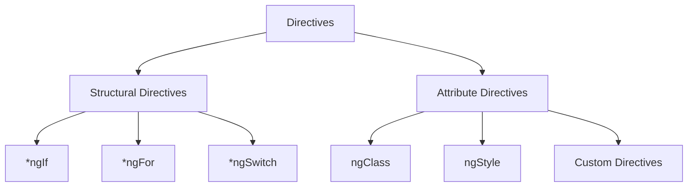

### Structural Directives

Structural directives change the DOM structure by adding or removing elements. They use `*` prefix.

#### `*ngIf` - Conditional Rendering

```html
<!-- home.component.html (FROM OUR PROJECT) -->
<div class="section-title" *ngIf="i === 0 && showSearchResults">
  Search Results for "{{ searchTerm }}"
</div>

<div class="section-title" *ngIf="!(i === 0 && showSearchResults)">
  {{ item.section.name }}
</div>

<!-- With else block -->
<div *ngIf="movie; else noMovie">
  <h1>{{ movie.title }}</h1>
</div>
<ng-template #noMovie>
  <p>No movie selected</p>
</ng-template>
```

**Important:** `*ngIf` completely removes/adds elements from the DOM, not just hides them.

#### `*ngFor` - Loop Through Arrays

```html
<!-- home.component.html (FROM OUR PROJECT) -->
<div class="section" *ngFor="let item of sectionsWithMovies; let i = index">
  <!--                  ↑ item variable    ↑ array to loop    ↑ index variable -->
  <div class="movie-card" *ngFor="let movie of item.movies">
    
    <div class="movie-title">{{ movie.title }}</div>
  </div>
</div>
```

**`*ngFor` exports several values:**

```html
<div *ngFor="let item of items; let i = index; let first = first; let last = last; let even = even; let odd = odd">
  <p>Index: {{ i }}</p>
  <p>First: {{ first }}</p>  <!-- true for first item -->
  <p>Last: {{ last }}</p>    <!-- true for last item -->
  <p>Even: {{ even }}</p>    <!-- true for even indices -->
  <p>Odd: {{ odd }}</p>      <!-- true for odd indices -->
</div>
```

**TrackBy for Performance:**

```typescript
// Component
trackByMovieId(index: number, movie: Movie): string {
  return movie.id;  // Unique identifier
}
```

```html
<div *ngFor="let movie of movies; trackBy: trackByMovieId">
  {{ movie.title }}
</div>
```

This helps Angular identify which items changed, improving performance.

#### `*ngSwitch` - Multiple Conditions

```html
<div [ngSwitch]="status">
  <p *ngSwitchCase="'loading'">Loading...</p>
  <p *ngSwitchCase="'success'">Success!</p>
  <p *ngSwitchCase="'error'">Error occurred</p>
  <p *ngSwitchDefault>Unknown status</p>
</div>
```

### Attribute Directives

Attribute directives change the appearance or behavior of an element.

#### `[class]` and `[ngClass]` - Dynamic Classes

```html
<!-- select-seats.component.html (FROM OUR PROJECT) -->
<div 
  class="seat"
  [class.filled]="isFilled(seat)"
  [class.chosen]="isSelected(seat)"
>
  {{ seat }}
</div>
<!-- ↑ Adds 'filled' class if isFilled(seat) returns true -->
<!-- ↑ Adds 'chosen' class if isSelected(seat) returns true -->
```

**Multiple classes with `ngClass`:**

```html
<div [ngClass]="{
  'active': isActive,
  'disabled': isDisabled,
  'highlight': isHighlighted
}">
  Content
</div>

<!-- Or with array -->
<div [ngClass]="['class1', 'class2', isActive ? 'active' : '']">
```

#### `[style]` and `[ngStyle]` - Dynamic Styles

```html
<div [style.color]="textColor">Colored text</div>
<div [style.font-size.px]="fontSize">Sized text</div>

<!-- Multiple styles with ngStyle -->
<div [ngStyle]="{
  'color': textColor,
  'font-size': fontSize + 'px',
  'background-color': bgColor
}">
  Styled content
</div>
```

### `ng-container` - Grouping Without Extra DOM Element

`ng-container` is a logical container that doesn't create an actual DOM element.

```html
<!-- Without ng-container (creates extra div) -->
<div *ngIf="showContent">
  <p>Line 1</p>
  <p>Line 2</p>
</div>

<!-- With ng-container (no extra element) -->
<ng-container *ngIf="showContent">
  <p>Line 1</p>
  <p>Line 2</p>
</ng-container>
```

**Use case:** When you need structural directives but don't want extra HTML elements.

### `ng-template` - Template Definition

`ng-template` defines a template that is not rendered by default. It's used with structural directives.

```html
<!-- Define template -->
<ng-template #loading>
  <div class="spinner">Loading...</div>
</ng-template>

<!-- Use with *ngIf else -->
<div *ngIf="data; else loading">
  {{ data }}
</div>

<!-- Or render programmatically -->
<ng-container *ngTemplateOutlet="loading"></ng-container>
```

**Key difference:**
- `ng-container`: Renders its content immediately (if conditions met)
- `ng-template`: Defines content but doesn't render until explicitly used

---

## Pipes

Pipes transform data in templates. They take data as input and return transformed output.

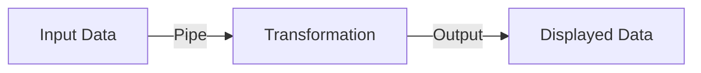

### Built-in Pipes

#### Date Pipe

```html
<!-- movie-detail.component.html (FROM OUR PROJECT) -->
<div>{{ selectedDate | date: 'dd MMMM yyyy' }}</div>
<!--   ↑ Input: '2024-11-15'  ↑ Pipe  ↑ Format -->
<!--   Output: '15 November 2024' -->
```

**Common date formats:**
- `'short'`: 11/15/24, 2:30 PM
- `'medium'`: Nov 15, 2024, 2:30:00 PM
- `'long'`: November 15, 2024 at 2:30:00 PM
- `'dd/MM/yyyy'`: 15/11/2024
- `'MMMM d, y'`: November 15, 2024

#### Number Pipes

```html
<!-- select-seats.component.html (FROM OUR PROJECT) -->
<div>Rs. {{ totalAmount.toLocaleString('id-ID') }}.000</div>
<!-- Note: toLocaleString is a JS method, not an Angular pipe -->

<!-- Angular number pipes: -->
{{ 1234.56 | number }}              <!-- 1,234.56 -->
{{ 1234.56 | number:'3.1-2' }}      <!-- 1,234.56 (3 min digits, 1-2 decimals) -->
{{ 0.259 | percent }}               <!-- 26% -->
{{ 1234.56 | currency:'USD' }}      <!-- $1,234.56 -->
{{ 1234.56 | currency:'INR':'symbol':'1.0-0' }}  <!-- ₹1,235 -->
```

#### String Pipes

```html
{{ 'hello world' | uppercase }}     <!-- HELLO WORLD -->
{{ 'HELLO WORLD' | lowercase }}     <!-- hello world -->
{{ 'hello world' | titlecase }}     <!-- Hello World -->
{{ longText | slice:0:100 }}        <!-- First 100 characters -->
```

#### JSON Pipe (for Debugging)

```html
<pre>{{ movie | json }}</pre>
<!-- Displays formatted JSON of the object -->
```

### Chaining Pipes

```html
{{ selectedDate | date:'fullDate' | uppercase }}
<!-- November 15, 2024 → NOVEMBER 15, 2024 -->
```

### Async Pipe

The `async` pipe subscribes to an Observable or Promise and returns the latest value.

```typescript
// Component
movies$: Observable<Movie[]>;

ngOnInit() {
  this.movies$ = this.movieService.getMovies();
  // Don't subscribe here!
}
```

```html
<!-- Template -->
<div *ngFor="let movie of movies$ | async">
  {{ movie.title }}
</div>
```

**Benefits of async pipe:**
- ✅ Automatically subscribes to Observable
- ✅ Automatically unsubscribes (prevents memory leaks)
- ✅ Triggers change detection when new value arrives
- ✅ Cleaner code

**Without async pipe (manual subscription):**
```typescript
// Component
movies: Movie[] = [];

ngOnInit() {
  this.movieService.getMovies().subscribe(movies => {
    this.movies = movies;
  });
  // ⚠️ Need to manually unsubscribe in ngOnDestroy
}
```

### Pure vs Impure Pipes

#### Pure Pipes (Default)

Pure pipes only execute when:
- Input value changes (primitive: string, number, boolean)
- Input reference changes (object, array)

```typescript
@Pipe({
  name: 'myPipe',
  pure: true  // ← Default
})
export class MyPipe implements PipeTransform {
  transform(value: any): any {
    console.log('Pipe executed');
    return value;
  }
}
```

**Example:**
```typescript
// Component
items = [1, 2, 3];

addItem() {
  this.items.push(4);  // ⚠️ Pure pipe won't detect this!
}

replaceItems() {
  this.items = [...this.items, 4];  // ✅ New reference, pipe executes
}
```

#### Impure Pipes

Impure pipes execute on every change detection cycle.

```typescript
@Pipe({
  name: 'myPipe',
  pure: false  // ← Impure
})
export class MyPipe implements PipeTransform {
  transform(value: any): any {
    console.log('Pipe executed on every change detection');
    return value;
  }
}
```

**⚠️ Warning:** Impure pipes can cause performance issues if the transformation is expensive.

### Custom Pipes

Create your own pipes for custom transformations.

```typescript
// capitalize.pipe.ts
import { Pipe, PipeTransform } from '@angular/core';

@Pipe({
  name: 'capitalize',
  standalone: true
})
export class CapitalizePipe implements PipeTransform {
  transform(value: string): string {
    if (!value) return value;
    return value.charAt(0).toUpperCase() + value.slice(1);
  }
}
```

```typescript
// Component
@Component({
  imports: [CapitalizePipe],  // ← Import the pipe
})
```

```html
<!-- Template -->
{{ 'hello' | capitalize }}  <!-- Hello -->
```

**Example from our project (as a method):**
```typescript
// movie-detail.component.ts
capitalize(str: string): string {
  return str.charAt(0).toUpperCase() + str.slice(1);
}
```

```html
<!-- movie-detail.component.html -->
<div>{{ theater.location | capitalize }}</div>
<!-- Could be converted to a pipe for reusability -->
```

---

## Input, Output & EventEmitter

Components communicate with each other using `@Input()` and `@Output()`.

```mermaid
graph TD
    A[Parent Component] -->|@Input| B[Child Component]
    B -->|@Output| A
```

### `@Input()` - Parent to Child Communication

Pass data from parent to child component.

```typescript
// header.component.ts (FROM OUR PROJECT)
export class HeaderComponent {
  @Output() searchEvent = new EventEmitter<string>();
  // This is actually an Output, let's create an Input example
}
```

**Better example (not in our project):**

```typescript
// movie-card.component.ts (EXAMPLE)
@Component({
  selector: 'app-movie-card',
  template: `
    <div class="card">
      <h3>{{ movie.title }}</h3>
      <p>{{ movie.rating }}</p>
    </div>
  `
})
export class MovieCardComponent {
  @Input() movie!: Movie;  // ← Receives data from parent
  @Input() showRating = true;  // ← With default value
}
```

```html
<!-- Parent template -->
<app-movie-card [movie]="selectedMovie" [showRating]="false"></app-movie-card>
<!--                ↑ Passing data to child -->
```

**Input with alias:**
```typescript
@Input('movieData') movie!: Movie;
```

```html
<app-movie-card [movieData]="selectedMovie"></app-movie-card>
```

### `@Output()` - Child to Parent Communication

Emit events from child to parent component.

```typescript
// header.component.ts (FROM OUR PROJECT)
export class HeaderComponent {
  @Output() searchEvent = new EventEmitter<string>();
  //        ↑ Output property  ↑ EventEmitter with type
  
  onSearchInput(): void {
    if (this.isOnHomePage) {
      this.searchEvent.emit(this.searchTerm);  // ← Emit event to parent
    }
  }
}
```

```html
<!-- home.component.html (FROM OUR PROJECT) -->
<app-header (searchEvent)="onSearch($event)"></app-header>
<!--         ↑ Listen to event  ↑ Handle in parent  ↑ Event data -->
```

```typescript
// home.component.ts (FROM OUR PROJECT)
export class HomeComponent {
  onSearch(searchTerm: string): void {
    this.searchTerm = searchTerm;
    if (!searchTerm.trim()) {
      this.searchResults = [];
      this.showSearchResults = false;
      return;
    }
    this.searchResults = this.movieService.searchMovies(searchTerm, this.movies);
    this.showSearchResults = true;
  }
}
```

### EventEmitter Flow

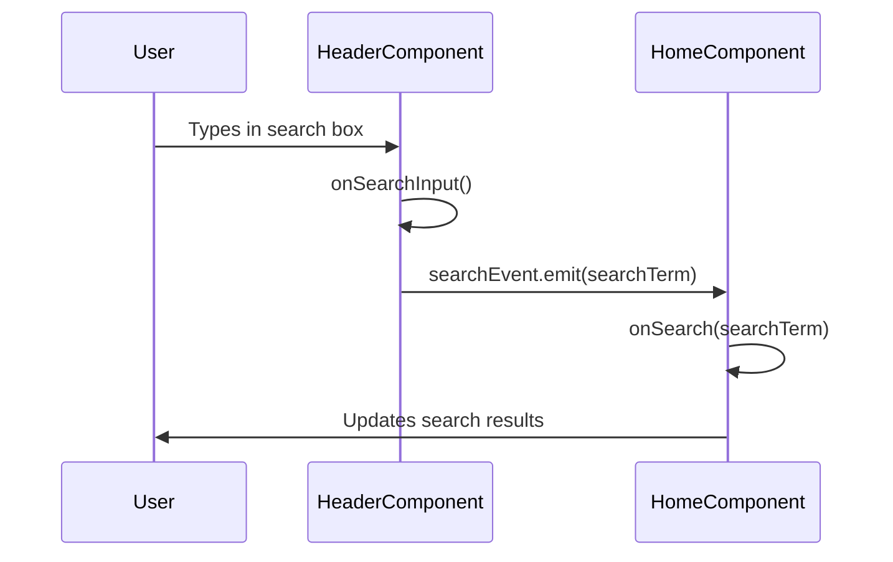

### Complete Example

```typescript
// child.component.ts
@Component({
  selector: 'app-child',
  template: `
    <button (click)="sendMessage()">Send to Parent</button>
  `
})
export class ChildComponent {
  @Input() childMessage!: string;
  @Output() messageEvent = new EventEmitter<string>();
  
  sendMessage() {
    this.messageEvent.emit('Hello from child!');
  }
}
```

```typescript
// parent.component.ts
@Component({
  selector: 'app-parent',
  template: `
    <app-child 
      [childMessage]="parentMessage"
      (messageEvent)="receiveMessage($event)"
    ></app-child>
    <p>{{ receivedMessage }}</p>
  `
})
export class ParentComponent {
  parentMessage = 'Message from parent';
  receivedMessage = '';
  
  receiveMessage(message: string) {
    this.receivedMessage = message;
  }
}
```

---

## Signals & Computed Signals

**Note:** Signals are a new feature in Angular 16+. Our project doesn't use them yet, but they're important to understand.

### What are Signals?

Signals are a reactive primitive for managing state. They notify Angular when values change.

```typescript
import { signal, computed } from '@angular/core';

export class MovieComponent {
  // Create a signal
  count = signal(0);
  
  // Read signal value
  ngOnInit() {
    console.log(this.count());  // ← Call it like a function
  }
  
  // Update signal value
  increment() {
    this.count.set(this.count() + 1);  // Set new value
    // or
    this.count.update(value => value + 1);  // Update based on current
  }
}
```

```html
<!-- Template -->
<p>Count: {{ count() }}</p>
<button (click)="increment()">Increment</button>
```

### Computed Signals

Computed signals derive their value from other signals. They automatically update when dependencies change.

```typescript
export class ShoppingCartComponent {
  items = signal([
    { name: 'Movie Ticket', price: 50, quantity: 2 },
    { name: 'Popcorn', price: 20, quantity: 1 }
  ]);
  
  // Computed signal - automatically recalculates when items change
  total = computed(() => {
    return this.items().reduce((sum, item) => 
      sum + (item.price * item.quantity), 0
    );
  });
  
  // Another computed signal
  itemCount = computed(() => this.items().length);
}
```

```html
<p>Total Items: {{ itemCount() }}</p>
<p>Total Price: Rs. {{ total() }}</p>
```

**When items signal changes, both computed signals automatically update!**

### Signals vs Traditional Approach

**Traditional (used in our project):**
```typescript
export class SelectSeatsComponent {
  selectedSeats: string[] = [];
  seatPrice = 50;
  
  get totalAmount(): number {
    return this.selectedSeats.length * this.seatPrice;
  }
}
```

**With Signals:**
```typescript
export class SelectSeatsComponent {
  selectedSeats = signal<string[]>([]);
  seatPrice = signal(50);
  
  totalAmount = computed(() => 
    this.selectedSeats().length * this.seatPrice()
  );
}
```

### Benefits of Signals

- ✅ More efficient change detection
- ✅ Clearer dependencies
- ✅ Better performance
- ✅ Easier to reason about state changes
- ✅ Works well with OnPush change detection strategy

### Effect (Side Effects with Signals)

```typescript
import { effect } from '@angular/core';

export class MovieComponent {
  searchTerm = signal('');
  
  constructor() {
    // Runs whenever searchTerm changes
    effect(() => {
      console.log('Search term changed:', this.searchTerm());
      // Perform side effects like API calls
    });
  }
}
```

---

## Content Projection

Content projection allows you to insert content from a parent component into a child component's template.

### `<ng-content>` - Basic Projection

```typescript
// card.component.ts (EXAMPLE)
@Component({
  selector: 'app-card',
  template: `
    <div class="card">
      <div class="card-header">
        <ng-content select="[header]"></ng-content>
      </div>
      <div class="card-body">
        <ng-content></ng-content>  <!-- Default slot -->
      </div>
      <div class="card-footer">
        <ng-content select="[footer]"></ng-content>
      </div>
    </div>
  `
})
export class CardComponent {}
```

```html
<!-- Parent template -->
<app-card>
  <h2 header>Movie Title</h2>
  <p>This is the movie description.</p>
  <button footer>Book Now</button>
</app-card>
```

**Result:**
```html
<div class="card">
  <div class="card-header">
    <h2>Movie Title</h2>
  </div>
  <div class="card-body">
    <p>This is the movie description.</p>
  </div>
  <div class="card-footer">
    <button>Book Now</button>
  </div>
</div>
```

### Multiple Slots

```typescript
@Component({
  selector: 'app-layout',
  template: `
    <header>
      <ng-content select="[slot=header]"></ng-content>
    </header>
    <main>
      <ng-content></ng-content>  <!-- Default -->
    </main>
    <footer>
      <ng-content select="[slot=footer]"></ng-content>
    </footer>
  `
})
```

```html
<app-layout>
  <div slot="header">Header Content</div>
  <p>Main content goes here</p>
  <div slot="footer">Footer Content</div>
</app-layout>
```

### Real-world Example from Our Project

Our project uses composition instead of content projection:

```html
<!-- home.component.html -->
<app-header (searchEvent)="onSearch($event)"></app-header>
<main class="movie-container">
  <!-- Content -->
</main>
<app-footer></app-footer>
```

**Could be refactored with content projection:**

```typescript
// layout.component.ts
@Component({
  selector: 'app-layout',
  template: `
    <app-header (searchEvent)="searchEvent.emit($event)"></app-header>
    <main class="movie-container">
      <ng-content></ng-content>
    </main>
    <app-footer></app-footer>
  `
})
export class LayoutComponent {
  @Output() searchEvent = new EventEmitter<string>();
}
```

```html
<!-- home.component.html -->
<app-layout (searchEvent)="onSearch($event)">
  <!-- All home content here -->
</app-layout>
```

---

## Routing & Lazy Loading

### Routing Basics

Routing allows navigation between different views/components.

```typescript
// app.routes.ts (FROM OUR PROJECT)
export const routes: Routes = [
  { path: '', redirectTo: '/signin', pathMatch: 'full' },
  { 
    path: 'signin', 
    loadComponent: () => import('./pages/signin/signin.component').then(m => m.SigninComponent)
  },
  { 
    path: 'home', 
    loadComponent: () => import('./pages/home/home.component').then(m => m.HomeComponent),
    canActivate: [authGuard]
  },
  { 
    path: 'movie/:id',  // ← Route parameter
    loadComponent: () => import('./pages/movie-detail/movie-detail.component').then(m => m.MovieDetailComponent),
    canActivate: [authGuard]
  },
  { path: '**', redirectTo: '/signin' }  // ← Wildcard route (404)
];
```

### Route Configuration

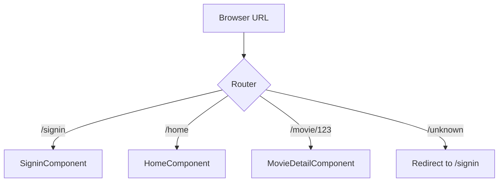

### Lazy Loading

**Lazy loading** loads components only when needed, reducing initial bundle size.

```typescript
// Eager loading (loads immediately)
import { HomeComponent } from './pages/home/home.component';
{ path: 'home', component: HomeComponent }

// Lazy loading (loads when route is accessed)
{ 
  path: 'home', 
  loadComponent: () => import('./pages/home/home.component').then(m => m.HomeComponent)
}
```

**Benefits:**
- ✅ Faster initial load time
- ✅ Smaller initial bundle
- ✅ Better performance
- ✅ Code splitting

### Navigation

#### Programmatic Navigation

```typescript
// home.component.ts (FROM OUR PROJECT)
export class HomeComponent {
  constructor(private router: Router) {}
  
  selectMovie(movie: Movie): void {
    this.bookingService.setSelectedMovie(movie);
    this.router.navigate(['/movie', movie.id]);
    //                    ↑ path    ↑ parameter
  }
}
```

#### Template Navigation

```html
<!-- Using routerLink directive -->
<a routerLink="/home">Home</a>
<a [routerLink]="['/movie', movie.id]">View Movie</a>

<!-- With query parameters -->
<a [routerLink]="['/search']" [queryParams]="{q: 'action', year: 2024}">
  Search
</a>
<!-- Results in: /search?q=action&year=2024 -->
```

### Route Parameters

#### Reading Route Parameters

```typescript
// movie-detail.component.ts (FROM OUR PROJECT)
export class MovieDetailComponent implements OnInit {
  constructor(
    private route: ActivatedRoute,
    private router: Router
  ) {}
  
  ngOnInit(): void {
    // Get route parameter
    const movieId = this.route.snapshot.paramMap.get('id');
    
    // Or subscribe to parameter changes
    this.route.paramMap.subscribe(params => {
      const id = params.get('id');
      this.loadMovie(id);
    });
  }
}
```

#### Query Parameters

```typescript
// Navigate with query params
this.router.navigate(['/search'], { 
  queryParams: { q: 'action', year: 2024 } 
});

// Read query params
this.route.queryParamMap.subscribe(params => {
  const query = params.get('q');
  const year = params.get('year');
});
```

### Router Outlet

```html
<!-- app.component.html -->
<router-outlet></router-outlet>
<!-- Components are rendered here based on route -->
```

### Navigation Guards (Covered in next section)

---

## Guards

Guards control access to routes. They can prevent navigation or redirect users.

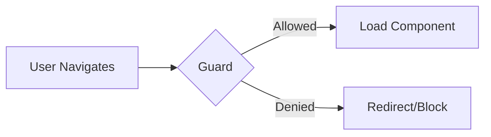

### Types of Guards

1. **CanActivate** - Can the route be activated?
2. **CanActivateChild** - Can child routes be activated?
3. **CanDeactivate** - Can the user leave the route?
4. **CanLoad** - Can the module be lazy loaded?
5. **Resolve** - Pre-fetch data before activating route

### Functional Guard (Modern Approach)

```typescript
// auth.guard.ts (FROM OUR PROJECT)
export const authGuard: CanActivateFn = () => {
  const authService = inject(AuthService);
  const router = inject(Router);

  if (authService.isAuthenticated()) {
    return true;  // ← Allow navigation
  }

  router.navigate(['/signin']);
  return false;  // ← Block navigation
};
```

### Using Guards in Routes

```typescript
// app.routes.ts (FROM OUR PROJECT)
export const routes: Routes = [
  { 
    path: 'home', 
    loadComponent: () => import('./pages/home/home.component').then(m => m.HomeComponent),
    canActivate: [authGuard]  // ← Guard applied here
  },
  { 
    path: 'movie/:id', 
    loadComponent: () => import('./pages/movie-detail/movie-detail.component').then(m => m.MovieDetailComponent),
    canActivate: [authGuard]
  }
];
```

### Guard Flow

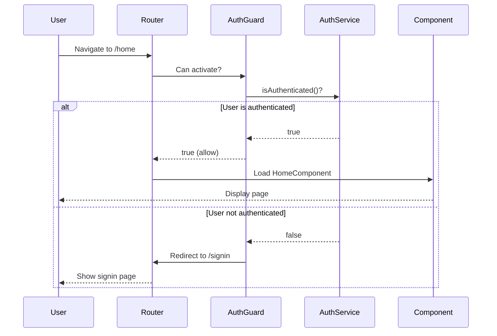

### Class-based Guard (Old Approach)

```typescript
// auth.guard.ts (OLD WAY)
@Injectable({
  providedIn: 'root'
})
export class AuthGuard implements CanActivate {
  constructor(
    private authService: AuthService,
    private router: Router
  ) {}
  
  canActivate(): boolean {
    if (this.authService.isAuthenticated()) {
      return true;
    }
    this.router.navigate(['/signin']);
    return false;
  }
}
```

### CanDeactivate Guard Example

Prevents users from leaving a page with unsaved changes.

```typescript
// unsaved-changes.guard.ts
export interface CanComponentDeactivate {
  canDeactivate: () => boolean | Observable<boolean>;
}

export const unsavedChangesGuard: CanDeactivateFn<CanComponentDeactivate> = (component) => {
  return component.canDeactivate ? component.canDeactivate() : true;
};
```

```typescript
// payment.component.ts
export class PaymentComponent implements CanComponentDeactivate {
  hasUnsavedChanges = false;
  
  canDeactivate(): boolean {
    if (this.hasUnsavedChanges) {
      return confirm('You have unsaved changes. Do you really want to leave?');
    }
    return true;
  }
}
```

```typescript
// routes
{ 
  path: 'payment', 
  component: PaymentComponent,
  canDeactivate: [unsavedChangesGuard]
}
```

---

## Advanced Concepts Summary

### RxJS Observables (Used in Services)

```typescript
// movie.service.ts (FROM OUR PROJECT)
getMovies(): Observable<Movie[]> {
  return this.http.get<Movie[]>(`${this.baseUrl}/movies.json`);
}
```

**Observable** is a stream of data over time. You subscribe to get values.

```typescript
// Component
this.movieService.getMovies().subscribe(movies => {
  this.movies = movies;
});
```

**Common RxJS operators:**
```typescript
import { map, filter, tap } from 'rxjs/operators';

this.movieService.getMovies().pipe(
  tap(movies => console.log('Fetched:', movies)),
  map(movies => movies.filter(m => m.rating > 8)),
  filter(movies => movies.length > 0)
).subscribe(topMovies => {
  this.topMovies = topMovies;
});
```

### HttpClient

```typescript
// auth.service.ts (FROM OUR PROJECT)
constructor(private http: HttpClient) {}

signIn(phone: string, password: string): Observable<User | null> {
  return this.http.get<User[]>('/assets/data/users.json').pipe(
    map(users => {
      const user = users.find(u => 
        u.phone_no === phone && u.password === password
      );
      return user || null;
    })
  );
}
```

**HTTP Methods:**
- `http.get<T>(url)` - GET request
- `http.post<T>(url, body)` - POST request
- `http.put<T>(url, body)` - PUT request
- `http.delete<T>(url)` - DELETE request
- `http.patch<T>(url, body)` - PATCH request

### LocalStorage (State Persistence)

```typescript
// booking.service.ts (FROM OUR PROJECT)
setSelectedMovie(movie: Movie): void {
  localStorage.setItem('selectedMovie', JSON.stringify(movie));
}

getSelectedMovie(): Movie | null {
  const movieStr = localStorage.getItem('selectedMovie');
  if (!movieStr) return null;
  try {
    return JSON.parse(movieStr);
  } catch {
    return null;
  }
}
```

---

## Project Architecture Overview

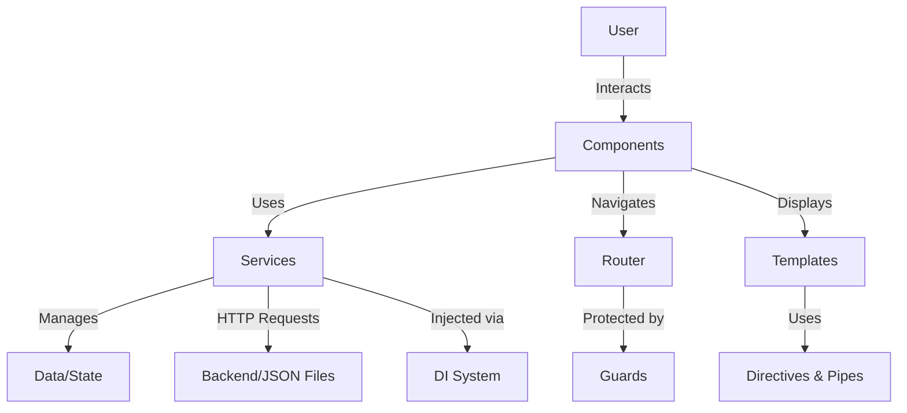

### Data Flow in Our Movie Booking App

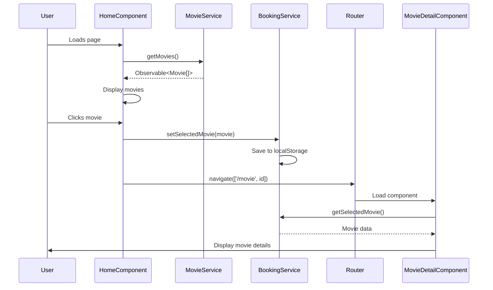

---

## Best Practices from This Project

### 1. Separation of Concerns

- **Components**: UI logic and user interaction
- **Services**: Business logic and data management
- **Models**: Type definitions
- **Guards**: Route protection

### 2. Standalone Components

- Modern approach, less boilerplate
- Clear dependencies in each component
- Better tree-shaking

### 3. Dependency Injection

- Services are singletons (`providedIn: 'root'`)
- Injected via constructor
- Easy to test and mock

### 4. Lazy Loading

- All routes use `loadComponent`
- Reduces initial bundle size
- Faster initial load

### 5. Type Safety

- TypeScript interfaces for all data models
- Strongly typed services and components
- Catch errors at compile time

### 6. Reactive Programming

- Use Observables for async operations
- Subscribe in components
- Unsubscribe in ngOnDestroy to prevent memory leaks

### 7. Component Lifecycle

- Use `ngOnInit` for initialization
- Use `ngOnDestroy` for cleanup
- Don't put logic in constructor

---

## Common Patterns in This Project

### 1. Service-based State Management

```typescript
// booking.service.ts
@Injectable({ providedIn: 'root' })
export class BookingService {
  private selectedMovie: Movie | null = null;
  
  setSelectedMovie(movie: Movie): void {
    this.selectedMovie = movie;
    localStorage.setItem('selectedMovie', JSON.stringify(movie));
  }
  
  getSelectedMovie(): Movie | null {
    // Return from memory or localStorage
  }
}
```

### 2. Guard-based Authentication

```typescript
// auth.guard.ts
export const authGuard: CanActivateFn = () => {
  const authService = inject(AuthService);
  const router = inject(Router);
  
  if (authService.isAuthenticated()) {
    return true;
  }
  
  router.navigate(['/signin']);
  return false;
};
```

### 3. Component Communication

**Parent → Child:** Via `@Input()`
**Child → Parent:** Via `@Output()` and `EventEmitter`
**Sibling Components:** Via shared service

```typescript
// header.component.ts (Child)
@Output() searchEvent = new EventEmitter<string>();

onSearchInput(): void {
  this.searchEvent.emit(this.searchTerm);
}
```

```html
<!-- home.component.html (Parent) -->
<app-header (searchEvent)="onSearch($event)"></app-header>
```

### 4. Computed Properties (Getters)

```typescript
// select-seats.component.ts
get totalAmount(): number {
  return this.selectedSeats.length * this.seatPrice;
}

get selectedSeatsDisplay(): string {
  return this.selectedSeats.length ? this.selectedSeats.join(', ') : '-';
}
```

```html
<div>Total: Rs. {{ totalAmount }}</div>
<div>Seats: {{ selectedSeatsDisplay }}</div>
```

---

## Quick Reference

### Component Decorator

```typescript
@Component({
  selector: 'app-name',           // How to use in HTML
  standalone: true,               // Standalone component
  imports: [CommonModule],        // Dependencies
  templateUrl: './name.html',     // External template
  styleUrls: ['./name.css']       // External styles
})
```

### Service Decorator

```typescript
@Injectable({
  providedIn: 'root'  // Singleton, app-wide
})
```

### Data Binding Syntax

| Syntax | Type | Direction | Example |
|--------|------|-----------|---------|
| `{{ }}` | Interpolation | Component → View | `{{ title }}` |
| `[]` | Property | Component → View | `[src]="url"` |
| `()` | Event | View → Component | `(click)="save()"` |
| `[()]` | Two-way | Both | `[(ngModel)]="name"` |

### Structural Directives

```html
<div *ngIf="condition">Show if true</div>
<div *ngFor="let item of items">{{ item }}</div>
<div [ngSwitch]="value">
  <p *ngSwitchCase="'a'">Case A</p>
  <p *ngSwitchDefault>Default</p>
</div>
```

### Attribute Directives

```html
<div [class.active]="isActive">Conditional class</div>
<div [ngClass]="{'active': isActive, 'disabled': isDisabled}">Multiple classes</div>
<div [style.color]="color">Inline style</div>
<div [ngStyle]="{'color': color, 'font-size': size}">Multiple styles</div>
```

### Lifecycle Hooks Order

1. `constructor()` - Dependency injection
2. `ngOnChanges()` - When @Input changes
3. `ngOnInit()` - Initialize component ⭐ Most used
4. `ngDoCheck()` - Custom change detection
5. `ngAfterContentInit()` - After content projection
6. `ngAfterContentChecked()` - After content check
7. `ngAfterViewInit()` - After view init
8. `ngAfterViewChecked()` - After view check
9. `ngOnDestroy()` - Cleanup ⭐ Important for subscriptions

### Common Pipes

```html
{{ date | date:'dd/MM/yyyy' }}
{{ price | currency:'USD' }}
{{ 0.5 | percent }}
{{ text | uppercase }}
{{ text | lowercase }}
{{ longText | slice:0:100 }}
{{ object | json }}
{{ observable$ | async }}
```

### Router Navigation

```typescript
// Programmatic
this.router.navigate(['/path']);
this.router.navigate(['/path', id]);
this.router.navigate(['/path'], { queryParams: { key: 'value' } });

// Template
<a routerLink="/path">Link</a>
<a [routerLink]="['/path', id]">Link with param</a>
```

### Dependency Injection

```typescript
// Service
@Injectable({ providedIn: 'root' })
export class MyService {}

// Component (constructor injection)
constructor(private myService: MyService) {}

// Functional (inject function)
const myService = inject(MyService);
```

---

## Comparison: Traditional vs Modern Angular

### Module-based (Old)

```typescript
// app.module.ts
@NgModule({
  declarations: [AppComponent, HomeComponent],
  imports: [BrowserModule, HttpClientModule],
  providers: [MovieService],
  bootstrap: [AppComponent]
})
export class AppModule {}
```

### Standalone (Modern - Our Project)

```typescript
// main.ts
bootstrapApplication(AppComponent, appConfig);

// Component
@Component({
  standalone: true,
  imports: [CommonModule, HeaderComponent]
})
export class HomeComponent {}
```

### Class Guard (Old)

```typescript
@Injectable()
export class AuthGuard implements CanActivate {
  canActivate(): boolean {
    return this.authService.isAuthenticated();
  }
}
```

### Functional Guard (Modern - Our Project)

```typescript
export const authGuard: CanActivateFn = () => {
  const authService = inject(AuthService);
  return authService.isAuthenticated();
};
```

---

## Debugging Tips

### 1. Check Component Lifecycle

```typescript
ngOnInit() {
  console.log('Component initialized');
}

ngOnDestroy() {
  console.log('Component destroyed');
}
```

### 2. Debug Observables

```typescript
this.movieService.getMovies().pipe(
  tap(movies => console.log('Movies:', movies))
).subscribe();
```

### 3. Template Debugging

```html
<!-- Display object structure -->
<pre>{{ movie | json }}</pre>

<!-- Check if variable exists -->
<div *ngIf="movie; else noMovie">
  {{ movie.title }}
</div>
<ng-template #noMovie>
  <p>No movie data</p>
</ng-template>
```

### 4. Check Route Parameters

```typescript
ngOnInit() {
  this.route.paramMap.subscribe(params => {
    console.log('Route params:', params);
    console.log('ID:', params.get('id'));
  });
}
```

---

## Performance Tips

### 1. Use OnPush Change Detection

```typescript
@Component({
  changeDetection: ChangeDetectionStrategy.OnPush
})
export class MyComponent {}
```

### 2. Unsubscribe from Observables

```typescript
private destroy$ = new Subject<void>();

ngOnInit() {
  this.movieService.getMovies()
    .pipe(takeUntil(this.destroy$))
    .subscribe(movies => this.movies = movies);
}

ngOnDestroy() {
  this.destroy$.next();
  this.destroy$.complete();
}
```

### 3. Use TrackBy with ngFor

```typescript
trackByFn(index: number, item: Movie): string {
  return item.id;
}
```

```html
<div *ngFor="let movie of movies; trackBy: trackByFn">
  {{ movie.title }}
</div>
```

### 4. Lazy Load Routes

```typescript
// All routes in our project use lazy loading
{ 
  path: 'home', 
  loadComponent: () => import('./pages/home/home.component').then(m => m.HomeComponent)
}
```

---

## Testing Concepts (Not Implemented in Project)

### Component Testing

```typescript
describe('HomeComponent', () => {
  let component: HomeComponent;
  let fixture: ComponentFixture<HomeComponent>;

  beforeEach(() => {
    TestBed.configureTestingModule({
      imports: [HomeComponent]
    });
    fixture = TestBed.createComponent(HomeComponent);
    component = fixture.componentInstance;
  });

  it('should create', () => {
    expect(component).toBeTruthy();
  });

  it('should load movies on init', () => {
    component.ngOnInit();
    expect(component.movies.length).toBeGreaterThan(0);
  });
});
```

### Service Testing

```typescript
describe('MovieService', () => {
  let service: MovieService;
  let httpMock: HttpTestingController;

  beforeEach(() => {
    TestBed.configureTestingModule({
      imports: [HttpClientTestingModule],
      providers: [MovieService]
    });
    service = TestBed.inject(MovieService);
    httpMock = TestBed.inject(HttpTestingController);
  });

  it('should fetch movies', () => {
    const mockMovies = [{ id: '1', title: 'Test Movie' }];
    
    service.getMovies().subscribe(movies => {
      expect(movies).toEqual(mockMovies);
    });

    const req = httpMock.expectOne('/assets/data/movies.json');
    expect(req.request.method).toBe('GET');
    req.flush(mockMovies);
  });
});
```

---

## Conclusion

This movie booking application demonstrates modern Angular concepts:

✅ **Standalone Components** - No NgModules needed
✅ **Dependency Injection** - Services injected via constructor
✅ **Component Lifecycle** - ngOnInit, ngOnDestroy
✅ **Templates & Data Binding** - Interpolation, property, event, two-way
✅ **Directives** - *ngIf, *ngFor, [class], [style]
✅ **Pipes** - date, number formatting
✅ **Input/Output** - Component communication
✅ **Routing** - Navigation between pages
✅ **Lazy Loading** - Load components on demand
✅ **Guards** - Route protection
✅ **Services** - Singleton pattern for state management
✅ **HttpClient** - API calls (JSON files)
✅ **LocalStorage** - State persistence

### Key Takeaways

1. **Components** are the building blocks
2. **Services** manage business logic and state
3. **DI** provides dependencies automatically
4. **Templates** use data binding to display data
5. **Directives** manipulate the DOM
6. **Pipes** transform data for display
7. **Routing** enables navigation
8. **Guards** protect routes
9. **Lifecycle hooks** let you tap into component lifecycle
10. **Standalone components** are the modern way

---

**Happy Learning! 🚀**
